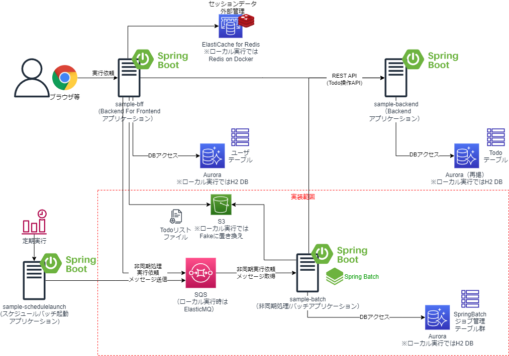

# SpringBootの非同期/バッチアプリケーションサンプル

## 概要
* Spring BootでSpring JMS + AWS SQS Messaging Libraryを使って、SQSを介在したメッセージング処理方式で非同期でジョブ実行する、非同期/バッチのサンプルAPである。同期実行処理アプリケーションは、Spring Batchを使用しており、非同期実行依頼メッセージで指定されたジョブIDとパラメータのジョブを実行するようになっている。
* 開発端末ローカル実行時にAWS SQSがなくても動作するよう、AP起動時にSQSの代わりにSQS互換のFakeとしてElasticMQを組み込みで起動して動作するため、特にAWS環境がなくても単独実行可能である。


## プロジェクト構成
* sample-bff
    * 別のプロジェクト。当該名称のリポジトリを参照のこと。Spring BootのWebブラウザアプリケーション（Backend for Frontend）で、ユーザがログイン後、TODOやユーザを管理する画面を提供する。また、画面やAPIからsample-batchへの非同期実行依頼も可能である。
        * デフォルトでは「spring.profiles.active」プロパティが「dev」になっている。プロファイルdevの場合は、RDB永続化にはH2DBによる組み込みDB、セッション外部化は無効化、SQS接続はsample-batch側で組み込みで起動するElasticMQへ送信するようになっている。
        * プロファイルproductionの場合は、RDB永続化にはPostgreSQL(AWS上はAurora等）、セッション外部化はRedis(ローカル時はRedis on Docker、AWS上はElastiCache for Redis)、SQS接続はSQSへ送信するようになっている。
* sample-backend（またはsample-backend-dynamodb)
    * 別プロジェクト。当該名称のリポジトリを参照のこと。Spring BootのREST APIアプリケーションで、sample-webやsample-batchが送信したREST APIのメッセージを受信し処理することが可能である。
        * sample-backendは永続化にRDBを使っているが、sample-backend-dynamodbは同じAPのDynamoDB版になっている。
        * デフォルトでは「spring.profiles.active」プロパティが「dev」になっている。プロファイルdevの場合は、RDB永続化にはH2DBによる組み込みDBになっている。また、sample-backend-dynamodbプロジェクトの場合は、AP起動時にDynamoDBの代わりに、DynamoDB Localを組み込みで起動し、接続するようになっている。
        * プロファイルproductionの場合は、RDB永続化にはPostgreSQL(AWS上はAurora等）になっている。また、sample-backend-dynamodbプロジェクトの場合は、DynamoDBに接続するようになっている。
* sample-batch
    * 本プロジェクト。Spring JMSを使ったSpring Bootの非同期処理アプリケーションで、sample-webやsample-schedulelaunchが送信した非同期実行依頼のメッセージをSQSを介して受信し処理することが可能である。    
        * デフォルトでは「spring.profiles.active」プロパティが「dev」になっている。プロファイルdevの場合は、AP起動時にSQSの代わりにElasticMQを組み込みで起動し、リッスンするようになっている。また、RDB永続化にはH2DBによる組み込みDBになっている。
        * プロファイルproductionの場合は、SQSをリッスンするようになっている。また、RDB永続化にはPostgreSQL(AWS上はAurora等）になっている。
* sample-schedulelaunch
    * 別プロジェクト。当該名称のリポジトリを参照のこと。SpringBootのCLIアプリケーションで、実行時に引数または環境変数で指定したスケジュール起動バッチ定義IDに対応するジョブの非同期実行依頼を実施し、SQSを介して、sample-batchアプリケーションのジョブを実行する。スケジュールによるバッチ起動を想定したアプリケーション。
        * デフォルトでは「spring.profiles.active」プロパティが「dev」になっている。プロファイルdevの場合は、SQS接続はsample-batch側で組み込みで起動するElasticMQへ送信するようになっている。
        * プロファイルproductionの場合は、SQS接続はSQSへ送信するようになっている。
## 事前準備
* 以下のライブラリを用いているので、EclipseのようなIDEを利用する場合には、プラグインのインストールが必要
    * [Lombok](https://projectlombok.org/)
        * [Eclipseへのプラグインインストール](https://projectlombok.org/setup/eclipse)
        * [IntelliJへのプラグインインストール](https://projectlombok.org/setup/intellij)
    * [Mapstruct](https://mapstruct.org/)
        * [EclipseやIntelliJへのプラグインインストール](https://mapstruct.org/documentation/ide-support/)

## 動作手順
1. Backend AP（sample-backend）の起動
    * sample-backendをSpringBoot Applicationとして起動。

1. Web AP（sample-bff）の起動
    * sample-bffをSpringBoot Applicationとして起動。

1. 非同期AP（sample-batch）の起動
    * sample-batchをSpringBoot Applicationとして起動。

1. 動作確認その1
    * sample-bffの「TODO一括登録」ユースケースにて、非同期処理の実行が使用されている。
    * ブラウザで「http://localhost:8080」にアクセス
    * ログイン後、メニュー画面「TODO一括登録」を選択
    * 「ファイル選択」ボタンを押下し、TODOリストのファイルを選択
        * テストデータとして、sample-bffプロジェクトのfilesフォルダにあるtodofile.csvを使用するとよい。
    * 登録ボタンを押下すると、ファイルをS3（ローカル実行ではローカル起動用のFakeで動作）に保存し、sample-batch側でTODO一括登録処理ジョブ（job003）が動作する。
        * TODOリストのファイルを読み込み、リストに対して一件ずつsample-backendのREST APIを呼び出し、TODOリストを一括登録する。
            * job003は、タスクレットモデルで実装している。(job001とほぼ同じ処理を実装している。)
1. 動作確認その2
    * ジョブのスケジュールバッチ起動を想定し、sample-schedulelaunchを、スケジュール起動バッチ定義IDを指定してSpringBootアプリケーションを起動する。
        * 起動引数に、-Dbatch.schedule.target-id=SB_001（またはSB_002）を指定する。
    * sample-batch側がジョブjob001（またはjob002）が動作する。
        * sample-batchのAPが、SQS(ElastiqMQ)を介してsample-webから受け取ったメッセージ（スケジュール起動バッチ定義に記載したJob IDとparam01、param02の値）を処理する。        
        * TODOリストが書かれたファイル(files/input/todolist.csv)を読み込み、リストに対して一件ずつsample-backendのREST APIを呼び出し、TODOリストを一括登録する。
            * job001は、タスクレットモデルで実装している。
            * job002は、チャンクモデルでjob001と同じ処理を実装している。    
1. 動作確認その3
    * sample-bffのAPIによるバッチの実行ユースケースがある。
    * ブラウザやREST APIクライアント（Postman等）で、以下入力する。 sample-bffのAPがリクエストを受け取り、SQS(ElastiqMQ)へ非同期実行依頼のメッセージを送信する。
        * GETメソッドの場合
        ```
        「http://localhost:8080/api/v1/async/(Job ID)?param01=(任意文字列)&param02=（任意の文字列）」
        #Job IDはjob001またはjob002を指定する

        #ローカル実行の場合の例
        http://localhost:8080/api/v1/async/job001?param01=aaa&param02=bbb

        http://localhost:8080/api/v1/async/job002?param01=aaa&param02=bbb

        #実行後、ブラウザに、以下の応答が返却
        {
            result: "accept"
        }    
        ```

        * POSTメソッドの場合（APIクライアントの使用が必要）
        ```
        「http://localhost:8080/api/v1/async」
        
        #リクエストボディの例
        #Job IDはjob001またはjob002を指定する  

        {
            "job_id" : "job001",
            "parameters" : {
                "param01" : "aaa",
                "param02" : "bbb"
            }
        }
        
        {
            "job_id" : "job002",
            "parameters" : {
                "param01" : "aaa",
                "param02" : "bbb"
            }
        }

        #実行後、APIクライアントに以下の応答が返却
        {
            result: "accept"
        }    
        ``` 

    * sample-batchのAPが、SQS(ElastiqMQ)を介してsample-webから受け取ったメッセージ（Job IDとparam01、param02の値）を処理する。        
        * TODOリストが書かれたファイル(files/input/todolist.csv)を読み込み、リストに対して一件ずつsample-backendのREST APIを呼び出し、TODOリストを一括登録する。
            * job001は、タスクレットモデルで実装している。
            * job002は、チャンクモデルでjob001と同じ処理を実装している。

## PostgreSQLのローカル起動
* Profileが「dev」でSpringBootアプリケーションを実行する場合、H2DBが起動するので、何もしなくてよい。
* Profileが「production」に切り替えてSpringBootアプリケーションを実行する場合、DBがPostgreSQLで動作する設定になっているため、事前にPostgreSQLを起動する必要がある。
    * AWS上でAPを起動する場合はAurora for PostgreSQLや、RDS for PostgreSQLを起動しておくことを想定している。
* Profile「procution」でAPをローカル実行する場合は、AP起動前にあらかじめ、PostgreSQLをDockerで起動しローカル実行しておく必要がある。以下で、PostgreSQLのローカル実行手順を示す。
```sh
#Postgres SQLの起動
docker run --name test-postgres -p 5432:5432 -e POSTGRES_PASSWORD=password -d postgres
#Postgresのコンテナにシェルで入って、psqlコマンドで接続
docker exec -i -t test-postgres /bin/bash
> psql -U postgres

# psqlで、testdbデータベースを作成
postgres> CREATE DATABASE testdb;
```

## SQSの設定
* デフォルトでは、「spring.profiles.active」プロパティが「dev」になっていて、プロファイルdevの場合、ElasticMQを使用するようになっている。
* Profileが「dev」でSpringBootアプリケーションを実行する場合、ElasitqMQが起動し、「SampleQueue」という名前のキューを作成するので、何もしなくてよい。
* Profileが「production」に切り替えてSpringBootアプリケーションを実行する場合、事前にAWS上にSQSのバケットを作成する必要がある。
    * 「production」に切り替えるには、例えばJVM引数を「-Dspring.profiles.active=production」に変更するか、環境変数「SPRING_PROFILES_ACTIVE=production」を設定する等して、sample-bff、sample-batchの両方のプロジェクトのプロファイルを「production」に変えて実行する。
    * 「SampleQueue」という名前のキューを作成すればよいが、キュー名を変更したい場合はapplication-production.ymlの「delayed.batch.queue」プロパティを作成したキュー名に変更する。
        * 「sample-batch」アプリケーション側も変更が必要
    * APがSQSにアクセスする権限が必要なので、開発端末上でローカル実行する場合はSQSのアクセス権限をもったIAMユーザのクレデンシャル情報が「%USERPROFILE%/.aws/credentials」や「~/.aws/credentials」に格納されている、もしくはEC2やECS等のAWS上のラインタイム環境で実行する場合は対象のAWSリソースにSQSのアクセス権限を持ったIAMロールが付与されている必要がある。

## S3の設定
* Profileが「dev」でSpringBootアプリケーションを実行する場合、S3アクセスは無効化し、ローカルのファイルシステムアクセスする設定になっている。
    * application-dev.ymlの「aws.s3.localfake.type」が「file」であり、「aws.s3.localfake.base-dir」を一時保存するファイルシステムのディレクトリパスが現状、C:\tmpになっているので、フォルダの変更が必要な場合は、変更する。
        * 「sample-batch」アプリケーション側も変更が必要
* Profileが「dev」でも、S3のローカル起動用のFake（MinIOやs3rver）を起動したい場合には、以下の通り
    * MinIOの場合
        * [MinIOのサイト](https://min.io/download#/windows)の手順に従い、インストールし、MinIOを起動
        * 以下は、Windows版での起動例
            * C:\minioフォルダにminio.exeを格納して、起動した例（デフォルトポート9000番ポートで起動、コンソールは9001番ポートで起動）
        ```sh        
        C:\minio\minio.exe server C:\minio\data --console-address ":9001"
        ```
        *  application-dev.ymlの「aws.s3.localfake.type」を「minio」に変更し、以下の通り設定
        ```yaml
        aws:
          s3:
            localfake:
              type: minio
              port: 9000
              access-key-id: minioadmin
              secret-access-key: minioadmin
            bucket: mysd33bucket123
        ```
    * s3rverの場合
        * [s3rverのサイト](https://github.com/jamhall/s3rver)の手順に従い、npmでインストールし、s3rverを起動
        * 以下、起動例
        ```
        s3rver -d C:\s3rver
        ```
        *  application-dev.ymlの「aws.s3.localfake.type」を「s3rver」に変更し、以下の通り設定
        ```yaml
        aws:
          s3:
            localfake:
              type: s3rver
              port: 4568
            bucket: mysd33bucket123
        ```

* Profileが「production」に切り替えてSpringBootアプリケーションを実行する場合、S3を使用する設定になっているため、事前にAWS上に、S3のバケットを作成する必要がある。
    * application-production.ymlの「aws.s3.bucket」プロパティを作成したバケット名に変更する。
    * APがS3にアクセスする権限が必要なので、開発端末上でローカル実行する場合はS3のアクセス権限をもったIAMユーザのクレデンシャル情報が「%USERPROFILE%/.aws/credentials」や「~/.aws/credentials」に格納されている、もしくはEC2やECS等のAWS上のラインタイム環境で実行する場合は対象のAWSリソースにSQSのアクセス権限を持ったIAMロールが付与されている必要がある。


## Dockerでのアプリ起動
* Mavenビルド
```sh
#Windows
.\mvnw.cmd package
#Linux/Mac
./mvnw package
```
* ローカルでDockerビルド
```sh
docker build -t XXXXXXXXXXXX.dkr.ecr.ap-northeast-1.amazonaws.com/sample-batch:latest .
```

* ローカルでDocker実行（Profileを「dev」でSpringBoot実行）
```sh
docker run -d -p 8001:8001 --name samplebatch --env SPRING_PROFILES_ACTIVE=dev,log_default --env SERVER_PORT=8001 --env SPRING_DATASOURCE_URL=jdbc:postgresql://(ローカルPCのプライベートIP):5432/testdb --env API_BACKEND_URL=http://(ローカルPCのプライベートIP):8000 XXXXXXXXXXXX.dkr.ecr.ap-northeast-1.amazonaws.com/sample-batch:latest

#logをjson形式に変更する場合
docker run -d -p 8001:8001 --name samplebatch --env SPRING_PROFILES_ACTIVE=dev,log_container --env SERVER_PORT=8001 --env SPRING_DATASOURCE_URL=jdbc:postgresql://(ローカルPCのプライベートIP):5432/testdb --env API_BACKEND_URL=http://(ローカルPCのプライベートIP):8000 XXXXXXXXXXXX.dkr.ecr.ap-northeast-1.amazonaws.com/sample-batch:latest
```

* ローカルでDocker実行（Profileを「production」でSpringBoot実行）　
    * ※Redisのローカル起動、PostgreSQLのローカル起動も必要
```sh
docker run -d -p 8001:8001 -v %USERPROFILE%\.aws\:/home/app/.aws/ --name samplebatch --env SPRING_PROFILES_ACTIVE=production,log_default --env SERVER_PORT=8001 --env API_BACKEND_URL=http://(ローカルPCのプライベートIP):8000 --env SPRING_DATASOURCE_URL=jdbc:postgresql://(ローカルPCのプライベートIP):5432/testdb XXXXXXXXXXXX.dkr.ecr.ap-northeast-1.amazonaws.com/sample-batch:latest

#logをjson形式に変更する場合
docker run -d -p 8001:8001 -v %USERPROFILE%\.aws\:/home/app/.aws/ --name samplebatch --env SPRING_PROFILES_ACTIVE=production,log_container --env SERVER_PORT=8001 --env API_BACKEND_URL=http://(ローカルPCのプライベートIP):8000 --env SPRING_DATASOURCE_URL=jdbc:postgresql://(ローカルPCのプライベートIP):5432/testdb XXXXXXXXXXXX.dkr.ecr.ap-northeast-1.amazonaws.com/sample-batch:latest
```

* ECRプッシュ
```sh
aws ecr get-login-password --region ap-northeast-1 | docker login --username AWS --password-stdin XXXXXXXXXXXX.dkr.ecr.ap-northeast-1.amazonaws.com
docker push XXXXXXXXXXXX.dkr.ecr.ap-northeast-1.amazonaws.com/sample-batch:latest
```

## ソフトウェアフレームワーク
* 本サンプルアプリケーションでは、ソフトウェアフレームワーク実装例も同梱している。簡単のため、アプリケーションと同じプロジェクトでソース管理している。
* ソースコードはcom.example.fwパッケージ配下に格納されている。    
    * 本格的な開発を実施する場合には、業務アプリケーションと別のGitリポジトリとして管理し、CodeArtifactやSonatype NEXUSといったライブラリリポジトリサーバでjarを管理し、pom.xmlから参照するようにすべきであるし、テストやCI/CD等もちゃんとすべきであるが、ここでは、あえて同じプロジェクトに格納してノウハウを簡単に参考にしてもらいやすいようにしている。
* 各機能と実現方式は、以下の通り。

| 分類 | 機能 | 機能概要と実現方式 | 拡張実装 | 拡張実装の格納パッケージ |
| ---- | ---- | ---- | ---- | ---- |
| バッチ | バッチAP制御 | Spring JMSとAmazon SQS Java Messaging Libraryを利用しSQSの標準キューを介した非同期実行依頼のメッセージを受信し、SpringBatchにより対象のジョブを起動する機能を提供する | ○ | com.example.fw.batch.async<br/>com.example.fw.batch.core<br/>com.example.fw.batch.store |
| | 大量データアクセス | SpringBatchのItemReader、ItemWriterを利用し、大容量のファイルやDBのレコードを逐次読み書きする機能を提供する。 | - | - |
| | 集約例外ハンドリング | エラー（例外）発生時、SpringBatchの機能によりDBのロールバックするとともに、JobExecutionListenerを利用しエラーログの出力といった共通的なエラーハンドリングを実施する。 | ○ | com.example.fw.batch.exeption<br/>com.example.fw.batch.listener |
| | トランザクション管理機能 | Spring Frameworkのトランザクション管理機能を利用して、タスクレットやチャンクに対するトランザクション管理を実現する機能を提供する。 | - | - |
| オン・バッチ共通 | RDBアクセス | MyBatisやSpringとの統合機能を利用し、DBコネクション取得、SQLの実行等のRDBへのアクセスのため定型的な処理を実施し、ORマッピングやSQLマッピングと呼ばれるドメイン層とインフラ層のインピーダンスミスマッチを吸収する機能を提供する。 | - | - |
| | HTTPクライアント | WebClientやRestTemplateを利用してREST APIの呼び出しやサーバエラー時の例外の取り扱いを制御する。 | ○ | com.example.fw.common.httpclient |
| | リトライ・サーキットブレーカ | Spring Cloud Circuit Breaker（Resillience4j）を利用し、REST APIの呼び出しでの一時的な障害に対する遮断やフォールバック処理等を制御する。また、WebClientのリトライ機能でエクスポネンシャルバックオフによりリトライを実現する。なお、AWSリソースのAPI呼び出しは、AWS SDKにてエクスポネンシャルバックオフによりリトライ処理を提供。 | - | - |
| | 分散トレーシング | Micrometer Tracingを利用して、トレースIDやスパンIDをAP間でのREST API呼び出しで引継ぎログに記録することで、分散トレーシングを実現する。 | - | - |
| | 非同期実行依頼 | Spring JMS、Amazon SQS Java Messaging Libraryを利用し、SQSの標準キューを介した非同期実行依頼のメッセージを送信する。 | ○ | com.example.fw.common.async |
| | 入力チェック| Java BeanValidationとSpringのValidation機能を利用し、単項目チェックや相関項目チェックといった画面の入力項目に対する形式的なチェックを実施する。 | ○ | com.example.fw.common.validation |
| | メッセージ管理 | MessageResourceで画面やログに出力するメッセージを管理する。 | ○ | com.example.fw.common.message |
| | 例外 | RuntimeExceptionを継承し、エラーコード（メッセージID）やメッセージを管理可能な共通的なビジネス例外、システム例外を提供する。 | ○ | com.example.fw.common.exception |
| | ロギング | Slf4jとLogback、SpringBootのLogback拡張の機能を利用し、プロファイルによって動作環境に応じたログレベルや出力先（ファイルや標準出力）、出力形式（タブ区切りやJSON）に切替可能とする。またメッセージIDをもとにログ出力可能な汎用的なAPIを提供する。 | ○ | com.example.fw.common.logging |
| | プロパティ管理 | SpringBootのプロパティ管理を使用して、APから環境依存のパラメータを切り出し、プロファイルによって動作環境に応じたパラメータ値に置き換え可能とする。 | - | - |
| | オブジェクトマッピング | MapStructを利用し、類似のプロパティを持つリソースオブジェクトやDTOとドメインオブジェクト間で、値のコピーやデータ変換処理を簡単にかつ高速に行えるようにする。 | - | - |
| | DI | Springを利用し、DI（依存性の注入）機能を提供する。 | - | - |
| | AOP | SpringとAspectJAOPを利用し、AOP機能を提供する。 | - | - |
| | ボイラープレートコード排除 | Lombokを利用し、オブジェクトのコンストラクタやGetter/Setter等のソースコードを自動生成し、ボイラープレートコードを排除する。 | - | - |
| | S3 Local起動 | 開発端末での動作確認のため、APをローカル起動可能とするようファイルシステムアクセスに差し替えたFakeやS3互換のFakeのサーバ（MinIO、s3ver）に接続する機能を提供する。 | ○ | com.example.fw.common.objectstorage |


* 以下は、今後追加適用を検討中。

| 分類 | 機能 | 機能概要と実現方式 | 拡張実装 | 拡張実装の格納パッケージ |
| ---- | ---- | ---- | ---- | ---- |
| オンバッチ共通 | プロパティ管理（SSM） | Spring Cloud for AWS機能により、APから環境依存のパラメータをAWSのSSMパラメータストアに切り出し、プロファイルによって動作環境に応じたパラメータ値に置き換え可能とする。 | - | - |
| | テストコード作成支援 | JUnit、Mockito、Springのテスト機能を利用して、単体テストコードや結合テストコードの実装を支援する機能を提供する。 | - | - |